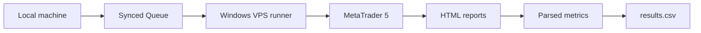

# MT5 Remote Backtest Automation

A file-driven automation service for running MetaTrader 5 backtests on a remote Windows machine.

The runner watches a synchronized queue of MT5 `.set` files, executes separate backtest and forward-test periods, parses the generated reports, and appends comparable metrics to a results table.

## Problem

MetaTrader optimization results are easy to generate but slow to validate consistently across independent backtest and forward periods. Manual reruns also create avoidable operational errors: inconsistent date windows, missed files, and incomplete metric capture.

This project turns that workflow into a small state machine that can run unattended on an MT5-enabled VPS.

## Architecture



The folders act as file-based inter-process communication:

- `Queue/`: strategies waiting to run;
- `Processing/`: the current job;
- `Processed/`: completed parameter files; and
- `Results/`: generated aggregate metrics.

## Two-pass workflow

1. Run the backtest period from `FromDate` to `SplitDate`.
2. Run the forward period from `SplitDate` to `ToDate`.
3. Parse both MT5 HTML reports.
4. Record profit, drawdown, trade count, win rate, profit factor, expected payoff, average winning and losing trade, and consecutive-loss metrics.
5. Move the processed `.set` file out of the queue.

## Repository structure

```text
.
├── src/
│   └── remote_runner.py
├── tests/
│   └── README.md
├── examples/
│   └── remote_config.example.json
├── docs/
│   └── architecture.md
├── pyproject.toml
├── KEYTAKEWAYS.md
└── README.md
```

Compiled executables are not stored in Git. Release binaries should be distributed through GitHub Releases.

## Setup

Requirements:

- Windows with Python 3.8 or newer;
- MetaTrader 5 installed on the remote machine;
- a synchronized folder shared between the local machine and VPS; and
- the required Expert Advisor installed in MT5.

```powershell
git clone https://github.com/rithik279/metatrader5-backtesting-automation.git
cd metatrader5-backtesting-automation
Copy-Item examples/remote_config.example.json remote_config.json
python src/remote_runner.py
```

Update the environment-specific MT5 paths and Expert Advisor settings before running. Keep `remote_config.json`, terminal hashes, broker-specific paths, reports, and result files out of version control.

## Configuration

`remote_config.json` controls the symbol, deposit, and date windows:

```json
{
  "Symbol": "DEMO_SYMBOL",
  "Deposit": "50000",
  "FromDate": "2026.01.01",
  "SplitDate": "2026.03.01",
  "ToDate": "2026.04.01",
  "ClearResults": false
}
```

## Known limitations

- Windows and MT5 are required for end-to-end execution.
- The workflow polls the queue rather than using events.
- HTML parsing depends on the MT5 report format.
- A failed MT5 process still needs stronger retry and recovery handling.
- The current runner contains environment-specific defaults that should be replaced with external configuration before reuse.

## What this project demonstrates

- automation across local and remote trading infrastructure;
- explicit workflow state using queue folders;
- subprocess orchestration for an external desktop trading platform;
- backtest/forward-test separation; and
- structured extraction of trading-system evaluation metrics.

## License

MIT
